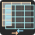
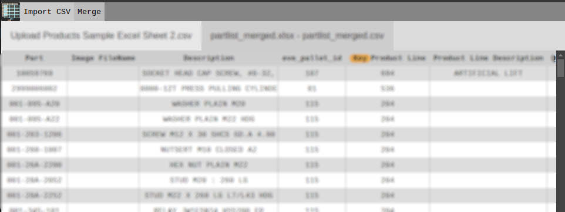

# mergemate
<h2 align="center">
merge CSV files easily using this web app written in ts/preact

</h2>

## implemented
- CSV parsing
 - comma and newline delimiter
 - quote escaping of comma for cell values
- CSV rendering
 - sticky header row
 - key marking per sheet
- merge button
 - merge panel shown
 - exit button functional
 - csvs to indexeddb[] for fast querying
 - basic merging functionality done, no output on screen yet
 - mark column as key per sheet

## mvp-todo
- mark column as unique, exclude
- key formula (ex: `a.trim().toLower()==b.trim().toLower()` ) 
- cell transform formula (ex: `v.trim().toLower()`)
- merge modes:
  - union (include only rows where keys match comparison across sheets)
  - exclusion (include only keys with no match comparison across sheets)
  - union-keep (union + keep unmatched key rows)
- export and download serialized CSV
- export preview that live regenerates when options changed